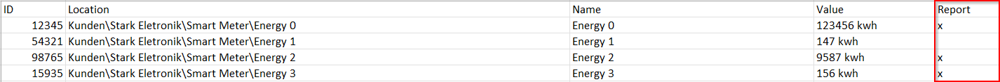
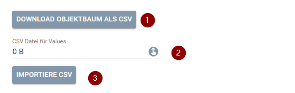

# Report
Beschreibung des Moduls.

### Inhaltsverzeichnis

- [Report](#report)
    - [Inhaltsverzeichnis](#inhaltsverzeichnis)
    - [1. Funktionsumfang](#1-funktionsumfang)
    - [2. Voraussetzungen](#2-voraussetzungen)
    - [3. Software-Installation](#3-software-installation)
    - [4. Einrichten der Instanzen in IP-Symcon](#4-einrichten-der-instanzen-in-ip-symcon)
    - [4.1 Variablen Massenimport](#41-variablen-massenimport)
    - [5. Statusvariablen und Profile](#5-statusvariablen-und-profile)
      - [Statusvariablen](#statusvariablen)
      - [Profile](#profile)
    - [6. WebFront](#6-webfront)

### 1. Funktionsumfang

* Report erstellen (CSV oder PDF)
  *  Zählerstand
  *  Verbrauch über einen vorgegebenen Zeitraum
*  Report kann per E-Mail versendet werden
*  Report kann über das Webfront manuell erstellt werden zu jedem Datum / Zeitraum
*  Automatischer Report der Zählerstände zum 1. des Monats, sowie zum 15. des Monats

### 2. Voraussetzungen

- IP-Symcon ab Version 6.0

### 3. Software-Installation

* Über den Module Store das 'Report'-Modul installieren, dazu muss eine Einladung der Stark Elektronik GmbH vorliegen.

### 4. Einrichten der Instanzen in IP-Symcon

 Unter 'Instanz hinzufügen' kann das 'Report'-Modul mithilfe des Schnellfilters gefunden werden.  
	- Weitere Informationen zum Hinzufügen von Instanzen in der [Dokumentation der Instanzen](https://www.symcon.de/service/dokumentation/konzepte/instanzen/#Instanz_hinzufügen)

__Konfigurationsseite__:

Name     | Beschreibung
-------- | ------------------
Absender | Name des Absenders im PDF Report.
SMTP Instanz        | Instanz für den E.-Mail Versand
Empfänger Adresse | E-Mail Adresse für den Empfänger des Reports
E-Mail Betreff | Betreff für die E-Mail des Report
E-Mail Nachricht | Inhalt der E-Mail
Logo | Logo welches auf im PDF Report angezeigt werden soll.
Berichts Variablen | Hier können die Variablen ausgewählt werden, welche auf de Bericht erscheinen sollen, es kann auch eine CSV Datei importiert werden (siehe Massenimport)
Bericht zur Mitte des Monats | Die CheckBox aktiviert einen Timer, der zur Mitte des Monats einen Bericht generiert.
Bericht zum Ende des Monats | Die CheckBox aktiviert einen Timer, der zum Ende des Monats einen Bericht generiert.

### 4.1 Variablen Massenimport

Über den Button "Download Objektbaum als CSV" (1) kann eine CSV Datei heruntergeladen werden, die alle Variablen des Objektbaumes in einer CSV Datei bereitstellt.
In der letzten Spalte "Report" (rot markiert), kann durch hinzufügen eines "x" die Variable für den Report ausgewählt werden. 

Sobald die Datei gespeichert ist, kann diese über die Konfigurationsform in das Modul geladen werden (2), nach einem Klick auf "Importiere CSV" (3), werden die Variablen dem Report hinzugefügt, diese Funktion dient für den Massenimport von Variablen für den Report.

### 5. Statusvariablen und Profile

Die Statusvariablen/Kategorien werden automatisch angelegt. Das Löschen einzelner kann zu Fehlfunktionen führen.

#### Statusvariablen

Name   | Typ     | Beschreibung
------ | ------- | ------------
Verbrauch | Boolean | Gibt an, ob im Bericht der Verbrauch über den gewählten Zeitraum angegeben wird.
Zählerstand | Boolean | Gibt an, ob im Bericht der Zählerstand zum Enddatum angegeben wird.
Versende Bericht per E-Mail | Boolean | Gibt an, ob der Bericht aus dem Webfront per E-Mail versendet werden soll.
E-Mail Adresse | String | Die E-Mail Adresse, an die der Bericht gesendet wird, wenn diese Feld leer bleibt, wird die E-Mail Adresse aus der Instanzkonfiguration genutzt.
Startdatum | Integer | Startdatum, welches benötigt wird, wenn der Verbrauch im Report angezeigt werden soll.
Enddatum | Integer | Datum des Zählerstandes und gleichzeitig das Enddatum des Zeitraums für den Verbrauch.
Aktion | String | Hier kann gewählt werden, in welchem Format der Report erstellt werden soll, der Report wird beim auswählen erstellt.
Bericht | Medien Objekt | In diesem Objekt wird der Bericht gespeichert und kann über das Webfront heruntergeladen werden.

Die Angaben im Webfront nehmen keinen Einfluss auf die automatischen (zum Ende oder zur Mitte des Monats) Reports.

#### Profile

Name   | Typ
------ | -------
StarkReport.Aktion | String

### 6. WebFront

Über das Webfront kann ein individueller Report generiert werden.