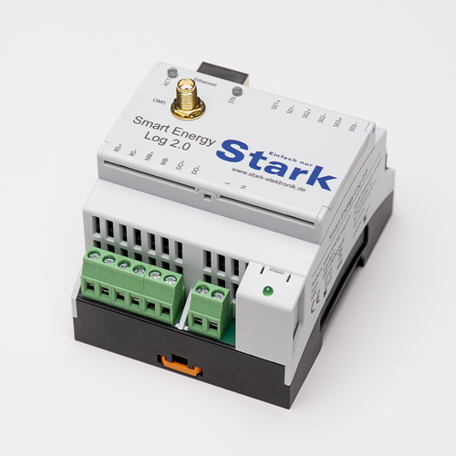

# Symcon_Smart_Metering
Das Modul dient dazu die Smart Energy Log 2.0 Geräte von Stark Elektronik in Symcon zu integrieren. 

Der Smart Energy Log ist eine Kommunikationszentrale zur Erfassung von Verbrauchs- und Sensordaten via M-Bus wM-Bus.

Bezug über https://stark-elektronik.de/

* <a href="http://example.com/](https://www.stark-elektronik.de/epages/63653058.sf/de_DE/?ObjectPath=/Shops/63653058/Products/SE-LOG-2.0">Direktlink: Smart Energy Log 2.0</a>

* <a href="http://example.com/](https://www.stark-elektronik.de/epages/63653058.sf/de_DE/?ObjectPath=/Shops/63653058/Products/SE-LOG-2.0G">Direktlink: Smart Energy Log 2.0 mit LTE</a>

# Vorraussetungen 

* IP-Symcon (Mind. Version 5.5)
* Stark Elektronik Smart Energy Log 2.0 mit mindestens einem Sensor.

# SmartLog
Der SmartLog spiegelt ein physisches Smart Energy Log Gerät wieder. Es kann eine beliebige Anzahl von Geräten verwendet werden (in der Praxis abhängig von der Leistung der Symcon-Instanz und der Aktualisierungsrate der Messwerte).
Der SmartLog stellt einen MQTT Client dar und verbindet sich mit dem Symcon-MQTT-Server.

__Konfigurationsseite__:

Name     | Beschreibung
-------- | ------------------
SmartLog ID         |Die SmartLog ID dient dazu, die Empfangen Daten dem richtigen SmartLog Gerät zuzuordnen

# SmartLogHTTPS
Der SmartLogHTTPS spiegelt ein physisches Smart Energy Log Gerät wieder. Es kann eine beliebige Anzahl von Geräten verwendet werden (in der Praxis abhängig von der Leistung der Symcon-Instanz und der Aktualisierungsrate der Messwerte).
Der SmartLogHTTPS stellt einen WebHook bereit, welcher über den SmartMeter Logger aufgerufen werden kann, um so die Daten in IP-Symcon zu übertragen.

Name     | Beschreibung
-------- | ------------------
SmartLog ID         |Die SmartLog ID dient dazu, die Empfangen Daten dem richtigen SmartLog Gerät zuzuordnen
WebHook Username         |Der Username schützt den WebHook in Kombination mit einem Passwort
WebHook Passwort         |Der Username schützt den WebHook in Kombination mit einem Passwort

Name     | Beschreibung
-------- | ------------------
Report Adresse | Die Report Adresse ist die Connect URL, welche im SmartMeter Logger unter "Report address" eingetragen werden muss.
Report Verzeichnis | Das Report Verzeichnis ist der Pfad, welcher im SmartMeter Logger unter "Report directory" eingetragen werden muss. Der Pfad stellt in IP-Symcon einen WebHook dar.

# SmartMeter
Das SmartMeter repräsentiert einen Zähler oder Sensor, der mit dem SmartLog Verbunden ist. Die einzelnen Parameter des Gerätes werden automatisch erstellt.

__Konfigurationsseite__:

Name     | Beschreibung
-------- | ------------------
SmartMeter ID         | Die SmartMeter ID dient dazu die die Empfangenen Daten dem richtigen Zähler oder Sensor zuzuordnern. Die ID wird beim Erstellen über den SmartMeterConfigurator automatisch zugewiesen. 
 Variablen automatisch erstellen        | Wenn das Flag "Variablen automatisch erstellen" ist werden die Von dem Sensor übertragen Daten automatisch als Variablen angelegt. Möchte man nicht alle Variablen nutzen kann man diese Funktion abschalten und die überflüssigen Variablen löschen. Bleibt die Funktion aktiv, werden auch neue oder selten gesendete Werte als neue variablen in Symcon angelegt

 # System
Die System Instanz visualisiert die Systemvariablen einer SmartMeter Loggers.

__Konfigurationsseite__:

Name     | Beschreibung
-------- | ------------------
SmartMeter ID         | Die SmartMeter ID dient dazu die die Empfangenen Daten dem richtigen Zähler oder Sensor zuzuordnern. Die ID wird beim Erstellen über den SmartMeterConfigurator automatisch zugewiesen. 
 Variablen automatisch erstellen        | Wenn das Flag "Variablen automatisch erstellen" ist werden die Von dem Sensor übertragen Daten automatisch als Variablen angelegt. Möchte man nicht alle Variablen nutzen kann man diese Funktion abschalten und die überflüssigen Variablen löschen. Bleibt die Funktion aktiv, werden auch neue oder selten gesendete Werte als neue variablen in Symcon angelegt

# SmartMeterConfigurator
Bei dem Konfigurator kann gewählt werden, ob das Modul per MQTT oder HTTPS (über den Connect Dienst) die Daten beziehen soll, für letzteres muss das Gateway des Konfigurators auf SmartLogHttps geändert werden.

Der SmartMeter Configurator wird für jedes SmartLog Separat angelegt und bietet die Möglichkeit die SmartMeter automatisch erstellen zu können. 

# Installation
Im Symcon Store das Modul "Smart Metering" von Stark Elektronik GmbH auswählen und installieren. 

Hier wird man gefragt ob man eine SmartMeterConfigurator Instanz erstellen möchte. 
Dann wird man von Symcon automatisch dur die Einstellungen der Instanzen von SmartLog, MQTT-Server und Server Socket geführt. 

(Sofern auf dem System bereits MQTT-Server installiert sind muss der Server für die SmartLogs ggf manuell angelegt werden)

Nach erfolgreicher installation werden neue SmartLog Instanzen automatisch im SmartMeterConfigurator angezeigt und können erstellt werden.

Die SmartMeter Instanzen werden unter SmartMetering/SmartLog[SmartLogID]/[Sensortyp]/[SensorID] angelegt. Die Variablennamen können nach belieben angepasst und an einen anderen Ort verschoben werden.   

